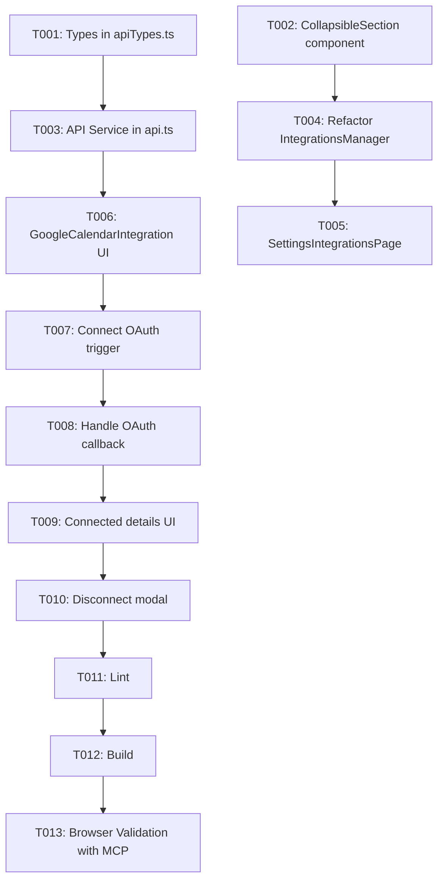

# Tasks: Google Calendar Integration & Collapsible Integrations UI

**Feature**: `specs/003-google-calendar-integration`
**Date**: 2026-08-17
**Spec**: [spec.md](file:///D:/Dev/ts-klip-project-frontend/specs/003-google-calendar-integration/spec.md) | **Plan**: [plan.md](file:///D:/Dev/ts-klip-project-frontend/specs/003-google-calendar-integration/plan.md)

## Phase 1: Setup (Shared Infrastructure)

**Purpose**: Type definitions and shared models for Google Calendar and collapsible integration views.

- [X] T001 [P] Add Google Calendar DTO types and response models in `src/types/apiTypes.ts`
- [X] T002 [P] Create reusable `CollapsibleSection` component with accessible toggle and badges in `src/components/CollapsibleSection.tsx`

---

## Phase 2: Foundational (Blocking Prerequisites)

**Purpose**: Service layer integration for Google Calendar endpoints.

- [X] T003 Implement `googleCalendarApi` methods (`getStatus`, `getAuthUrl`, `handleCallback`, `disconnect`) in `src/services/api.ts`

**Checkpoint**: Core types and API client functions are ready.

---

## Phase 3: User Story 1 - Collapsible Sections for Integrations (Priority: P1) 🎯 MVP

**Goal**: Organize the Integrations settings page into clear, expandable/collapsible panels for MCP Servers and Google Calendar.

**Independent Test**: Navigate to `/settings/integrations` and toggle open/collapsed state of the MCP Servers and Google Calendar sections.

### Implementation for User Story 1

- [X] T004 [US1] Refactor `src/components/IntegrationsManager.tsx` to wrap MCP key management inside `CollapsibleSection`
- [X] T005 [US1] Update `src/pages/SettingsIntegrationsPage.tsx` to display structured collapsible integration cards

**Checkpoint**: Integrations page organizes services cleanly in collapsible panels with MCP Server keys intact.

---

## Phase 4: User Story 2 - Google Calendar Connection Status & Linking (Priority: P1)

**Goal**: Enable users to view Google Calendar status, start OAuth connection, and handle OAuth callback redirects gracefully.

**Independent Test**: Expand Google Calendar section, verify status badge, click "Conectar Google Calendar", and verify callback query handling on return.

### Implementation for User Story 2

- [X] T006 [P] [US2] Create `src/components/GoogleCalendarIntegration.tsx` with disconnected state, feature description, and connect button
- [X] T007 [US2] Implement OAuth redirect trigger (`getAuthUrl`) and loading state in `src/components/GoogleCalendarIntegration.tsx`
- [X] T008 [US2] Handle OAuth return query params (`code`, `state`, `error`) in `src/pages/SettingsIntegrationsPage.tsx` with toast notifications and URL cleanup

**Checkpoint**: Disconnected state displays properly, connect action redirects to Google OAuth, and returns are handled smoothly.

---

## Phase 5: User Story 3 - View Connected Account Details & Disconnect (Priority: P2)

**Goal**: Display linked Google account details and provide a safe disconnect modal to unlink the integration.

**Independent Test**: In connected state, verify email and date are formatted, click "Desconectar", confirm in modal, and verify state resets to disconnected.

### Implementation for User Story 3

- [X] T009 [US3] Add connected state display (email, formatted connection date with `date-fns`) in `src/components/GoogleCalendarIntegration.tsx`
- [X] T010 [US3] Implement disconnect confirmation dialog and execute `deleteGoogleCalendar` API call in `src/components/GoogleCalendarIntegration.tsx`

**Checkpoint**: Complete lifecycle (connect, view details, disconnect with confirmation) functions seamlessly.

---

## Phase 6: Polish & Cross-Cutting Concerns

**Purpose**: Validation, linting, build verification, and end-to-end browser testing with Chrome DevTools MCP.

- [X] T011 Run linter (`npm run lint`) and fix any warnings or errors
- [X] T012 Run build check (`npm run build`) to ensure bundle compiles cleanly
- [X] T013 Validate collapsible sections and Google Calendar UI on `http://localhost:5173/settings/integrations` using Chrome DevTools MCP

---

## Dependencies & Execution Order

### Parallel Opportunities

- **Phase 1**: `T001` (DTO types) and `T002` (`CollapsibleSection.tsx`) can be created in parallel.
- **Phase 4**: `T006` (`GoogleCalendarIntegration.tsx` disconnected view) can be developed alongside `T004`.
