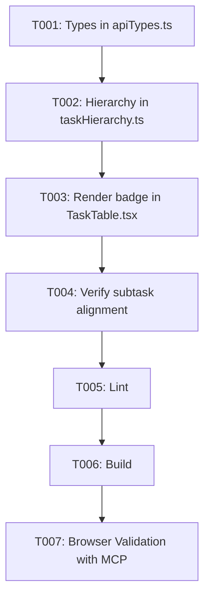

# Tasks: Google Calendar Synchronization Indicator on Tasks

**Feature**: `specs/004-task-calendar-badge`
**Date**: 2026-08-17
**Spec**: [spec.md](file:///D:/Dev/ts-klip-project-frontend/specs/004-task-calendar-badge/spec.md) | **Plan**: [plan.md](file:///D:/Dev/ts-klip-project-frontend/specs/004-task-calendar-badge/plan.md)

## Phase 1: Setup (Shared Infrastructure)

**Purpose**: Type definitions for Google Calendar event ID in task models.

- [X] T001 [P] Add `googleCalendarEventId` and `google_calendar_event_id` fields to `GetTasksDto` in `src/types/apiTypes.ts`

---

## Phase 2: Foundational (Blocking Prerequisites)

**Purpose**: Verification of task model propagation.

- [X] T002 Verify task hierarchy transformation retains `googleCalendarEventId` on tree nodes in `src/lib/taskHierarchy.ts`

**Checkpoint**: Task models and tree structures pass `googleCalendarEventId` down to rows.

---

## Phase 3: User Story 1 - Visual Synchronization Indicator in Task List (Priority: P1) 🎯 MVP

**Goal**: Display an accessible Google Calendar badge beside task titles for synced tasks and subtasks across Inbox, Projects, and Calendar views.

**Independent Test**: View tasks in `TaskTable` and verify that only tasks with `googleCalendarEventId` display the calendar icon with tooltip.

### Implementation for User Story 1

- [X] T003 [US1] Render Google Calendar icon badge with tooltip in the task title column in `src/components/TaskTable.tsx`
- [X] T004 [US1] Verify styling, contrast, and alignment for both parent tasks and subtasks in `src/components/TaskTable.tsx`

**Checkpoint**: Synchronized tasks visually stand out with an amber Google Calendar indicator and clear tooltip.

---

## Phase 4: Polish & Cross-Cutting Concerns

**Purpose**: Quality checks, build verification, and end-to-end browser testing with Chrome DevTools MCP.

- [X] T005 Run linter (`npm run lint`) and fix any warnings or errors
- [X] T006 Run build check (`npm run build`) to ensure clean compilation
- [X] T007 Validate task sync badge rendering in `http://localhost:5173/` using Chrome DevTools MCP

---

## Dependencies & Execution Order

### Implementation Strategy

- **MVP First**: Tasks T001 through T004 provide immediate end-to-end user value across all task views (`HomePage`, `MonthViewPage`, `ProjectsPage`).
- **Validation**: Finish with T005-T007 to guarantee quality and standards compliance.
