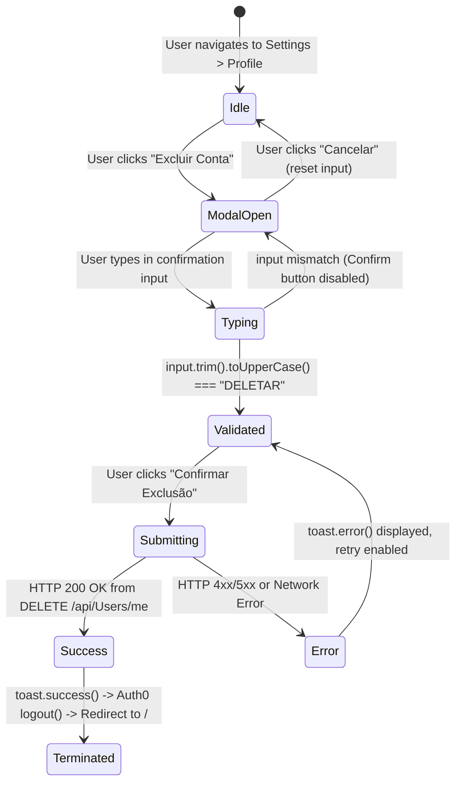

# Data Model: Self-Service Account Deletion

## Frontend Data Structures & Interfaces

### 1. Account Deletion Modal Props
```typescript
export interface DeleteAccountModalProps {
  isOpen: boolean;
  onClose: () => void;
  onConfirm: () => Promise<void>;
  userEmail?: string;
}
```

### 2. Deletion Confirmation State
```typescript
export interface AccountDeletionState {
  inputText: string;
  isMatch: boolean;
  isSubmitting: boolean;
  error: string | null;
}
```

### 3. API Response Model
```typescript
// Shared from apiTypes.ts
export interface ResponseModelDto<T> {
  data: T;
  message: string | null;
  status: boolean;
  timestamp?: string;
}

// DELETE /api/Users/me returns ResponseModelDto<boolean>
export type DeleteUserResponse = ResponseModelDto<boolean>;
```

## State Lifecycle & Transitions


