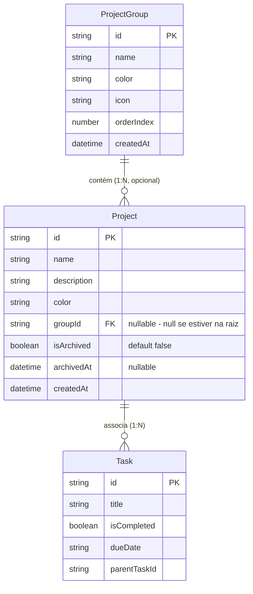
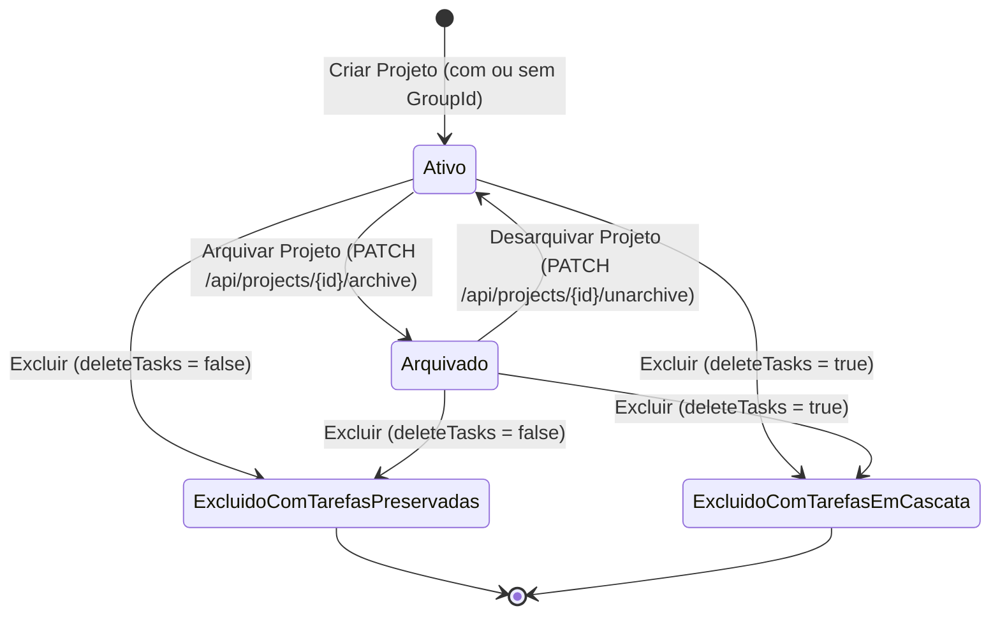

# Data Model: Organização, Agrupamento e Ciclo de Vida de Projetos

**Feature**: `007-project-organization-lifecycle` | **Date**: 2026-08-23

## 1. Domain Entities & TypeScript Models

### A. Grupo de Projetos (`ProjectGroup`)

```typescript
export interface CreateProjectGroupDto {
  name: string;
  color?: string;
  icon?: string;
  orderIndex?: number;
}

export interface GetProjectGroupDto {
  id: string;
  name: string;
  color?: string;
  icon?: string;
  orderIndex: number;
  createdAt: string;
  projects: GetProjectsDto[];
}

export interface ReorderProjectGroupsDto {
  groupIdsInOrder: string[];
}
```

### B. Projeto (`Project`) com Agrupamento e Ciclo de Vida

```typescript
export interface CreateProjectDto {
  name: string;
  description?: string;
  color?: string;
  groupId?: string | null;
}

export interface GetProjectsDto {
  id: string;
  name: string;
  description?: string;
  color?: string;
  groupId?: string | null;
  isArchived?: boolean;
  archivedAt?: string | null;
  createdAt: string;
}

export interface DeleteProjectOptions {
  deleteTasks?: boolean;
}
```

---

## 2. Diagrama de Relacionamentos no Frontend



---

## 3. Máquina de Estados e Transições do Projeto



---

## 4. Contexto de Estado Global (`ProjectsContextValue`)

```typescript
export interface ProjectsContextValue {
  // Projetos Ativos
  projects: GetProjectsDto[];
  fetchProjects: (options?: { force?: boolean; archived?: boolean }) => Promise<GetProjectsDto[]>;
  updateProjectLocal: (projectId: string, updates: Partial<GetProjectsDto>) => void;
  removeProjectLocal: (projectId: string) => void;

  // Grupos de Projetos
  projectGroups: GetProjectGroupDto[];
  fetchProjectGroups: (options?: { force?: boolean }) => Promise<GetProjectGroupDto[]>;
  createProjectGroup: (data: CreateProjectGroupDto) => Promise<GetProjectGroupDto>;
  updateProjectGroup: (id: string, data: CreateProjectGroupDto) => Promise<GetProjectGroupDto>;
  deleteProjectGroup: (id: string) => Promise<void>;
  reorderProjectGroups: (groupIdsInOrder: string[]) => Promise<void>;

  // Projetos Arquivados e Ações de Ciclo de Vida
  archivedProjects: GetProjectsDto[];
  fetchArchivedProjects: () => Promise<GetProjectsDto[]>;
  archiveProject: (projectId: string) => Promise<void>;
  unarchiveProject: (projectId: string) => Promise<void>;
  deleteProject: (projectId: string, deleteTasks?: boolean) => Promise<void>;
}
```
