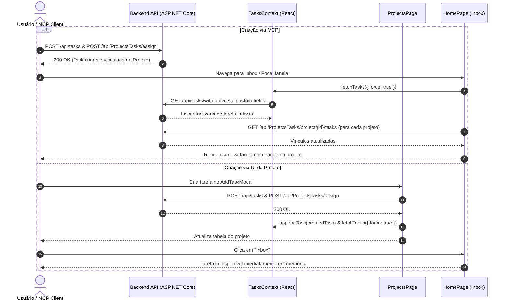

# Data Model & Sync Flow: Sincronização de Tarefas de Projetos no Inbox

**Feature**: `008-inbox-task-sync` | **Date**: 2026-08-23

## 1. Fluxo de Sincronização de Tarefas (Data Flow)



---

## 2. Entidades Envolvidas e Estado

### Estado em `TasksContext`
```typescript
interface TasksContextValue {
  tasks: GetTasksWithCustomFieldsDto[];
  fetchTasks: (options?: { force?: boolean }) => Promise<void>;
  appendTask: (task: GetTasksWithCustomFieldsDto) => void;
  updateTaskLocal: (taskId: string, updates: Partial<GetTasksWithCustomFieldsDto>) => void;
  removeTaskLocal: (taskId: string) => void;
  removeTasksLocal: (taskIds: string[]) => void;
}
```

### Estado de Vínculos em `HomePage`
```typescript
interface ProjectTaskAssignment {
  project_id: string;
  task_id: string;
}
```
