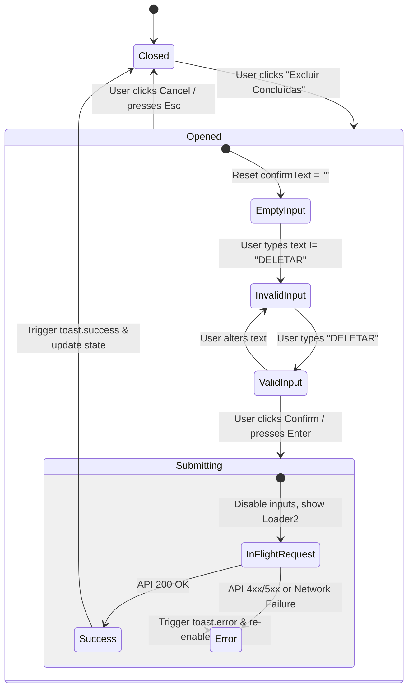
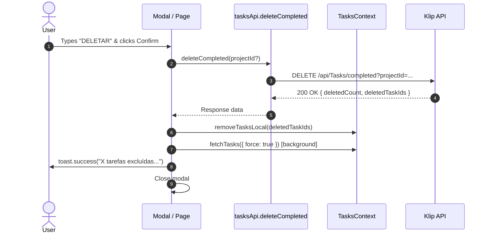

# Data Model & State Transitions: Exclusão em Lote de Tarefas Concluídas

**Feature Branch**: `009-delete-completed-tasks` | **Date**: 2026-08-25

## 1. Domain Entities & Interfaces

### 1.1 API Response Types

```typescript
// src/types/apiTypes.ts

/**
 * Result returned by the backend upon bulk deletion of completed tasks
 */
export interface DeleteCompletedTasksResponseDto {
  /** Total number of tasks permanently deleted */
  deletedCount: number;
  /** List of UUIDs of the deleted tasks for local state reconciliation */
  deletedTaskIds: string[];
}
```

### 1.2 Modal Props

```typescript
// src/types/taskDeletion.ts or src/components/DeleteCompletedTasksModal.tsx

export interface DeleteCompletedTasksModalProps {
  /** Controls modal visibility */
  isOpen: boolean;
  /** Callback invoked when the modal is closed or cancelled */
  onClose: () => void;
  /** Callback invoked when the user confirms deletion */
  onConfirm: () => Promise<void>;
  /** Optional project name; if omitted, modal operates in Global Deletion scope */
  projectName?: string;
}
```

### 1.3 Deletion Scope Enum/Type

```typescript
export type DeletionScope = 'global' | 'project';
```

---

## 2. Component State Transitions

### 2.1 Modal Dialog State Machine



### 2.2 Global & Local Tasks Synchronization



---

## 3. Validation Rules

1. **Confirmation Keyword**:
   - Must match `DELETAR` exactly (case-insensitive with trimming before comparison, i.e., `inputText.trim().toUpperCase() === "DELETAR"`).
   - Button remains disabled (`disabled={!isMatch || isSubmitting}`) whenever this condition is not met.
2. **Submission Concurrency Guard**:
   - `isSubmitting` flag must lock the confirmation button, cancel button, and text input while the network request is pending.
3. **Local State Hygiene**:
   - When deleting within a project (`projectId` present), only tasks associated with that project are removed from the local view.
   - When deleting globally (`projectId` absent), all completed tasks are stripped from `TasksContext`.
