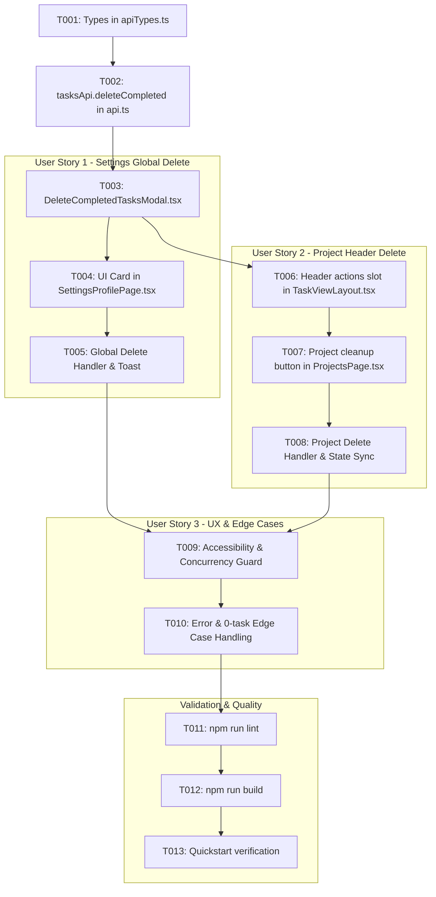

# Tasks: Exclusão em Lote de Tarefas Concluídas

**Feature**: Exclusão em Lote de Tarefas Concluídas
**Branch**: `009-delete-completed-tasks`
**Spec**: [specs/009-delete-completed-tasks/spec.md](file:///D:/Dev/ts-klip-project-frontend/specs/009-delete-completed-tasks/spec.md)
**Plan**: [specs/009-delete-completed-tasks/plan.md](file:///D:/Dev/ts-klip-project-frontend/specs/009-delete-completed-tasks/plan.md)

---

## Phase 1: Setup (Shared Infrastructure)

**Purpose**: Define data types and response interfaces for the new endpoint

- [X] T001 [P] Create type definition `DeleteCompletedTasksResponseDto` in `src/types/apiTypes.ts`

---

## Phase 2: Foundational (Blocking Prerequisites)

**Purpose**: Implement the API client method and core reusable modal component

**⚠️ CRITICAL**: Must be completed before User Stories implementation

- [X] T002 Implement `tasksApi.deleteCompleted(projectId?: string)` in `src/services/api.ts` calling `DELETE /api/Tasks/completed`
- [X] T003 Create reusable confirmation modal component `DeleteCompletedTasksModal` in `src/components/DeleteCompletedTasksModal.tsx` with `DELETAR` typed confirmation, `isSubmitting` state, loading spinner, and keyboard support

**Checkpoint**: Foundation ready - User Stories can now be implemented

---

## Phase 3: User Story 1 - Exclusão Global de Tarefas Concluídas nas Configurações (Priority: P1) 🎯 MVP

**Goal**: Permitir que o usuário exclua permanentemente todas as tarefas concluídas da conta a partir da Zona de Perigo nas Configurações com confirmação textual

**Independent Test**: Acessar `/settings/profile`, acionar o botão de exclusão de tarefas concluídas na Zona de Perigo, digitar `DELETAR` e confirmar; verificar que todas as tarefas concluídas da conta são removidas e o toast exibe a contagem de tarefas excluídas.

### Implementation for User Story 1

- [X] T004 [US1] Add Danger Zone card and button for bulk completed tasks deletion in `src/pages/SettingsProfilePage.tsx`
- [X] T005 [US1] Implement global deletion handler in `src/pages/SettingsProfilePage.tsx` using `tasksApi.deleteCompleted()`, reconciling `TasksContext` via `removeTasksLocal` and displaying success/error toasts

**Checkpoint**: User Story 1 (MVP) is fully functional and testable independently

---

## Phase 4: User Story 2 - Exclusão de Tarefas Concluídas no Contexto de um Projeto (Priority: P2)

**Goal**: Permitir que o usuário exclua apenas as tarefas concluídas de um projeto específico através de um botão no cabeçalho da página do projeto com confirmação textual

**Independent Test**: Abrir um projeto em `/project/:projectId`, clicar no botão de limpar tarefas concluídas no cabeçalho superior, digitar `DELETAR` e confirmar; verificar que apenas as tarefas concluídas daquele projeto são excluídas.

### Implementation for User Story 2

- [X] T006 [P] [US2] Extend `TaskViewLayout` in `src/components/TaskViewLayout.tsx` to support custom header action buttons (`actions?: ReactNode`)
- [X] T007 [US2] Add project cleanup button to header and integrate `DeleteCompletedTasksModal` with `currentProject.name` in `src/pages/ProjectsPage.tsx`
- [X] T008 [US2] Implement project deletion handler in `src/pages/ProjectsPage.tsx` invoking `tasksApi.deleteCompleted(projectId)`, updating local project state, updating `TasksContext` via `removeTasksLocal`, and displaying success/error toasts

**Checkpoint**: User Stories 1 AND 2 are independently functional and testable

---

## Phase 5: User Story 3 - Feedback de Processamento, Acessibilidade e Prevenção de Erros (Priority: P3)

**Goal**: Assegurar acessibilidade (foco inicial, atalhos `Enter`/`Esc`), prevenção de cliques duplos/submissão concorrente e tratamento resiliente de erros ou projetos sem tarefas concluídas

**Independent Test**: Disparar a exclusão com lentidão ou em um projeto sem tarefas concluídas; validar bloqueio de inputs durante envio e mensagem adequada quando 0 tarefas forem removidas.

### Implementation for User Story 3

- [X] T009 [US3] Ensure input auto-focus, keyboard shortcuts (`Enter` to submit, `Esc` to cancel), and interactive control disabling during request in `src/components/DeleteCompletedTasksModal.tsx`
- [X] T010 [US3] Verify graceful handling for 0-task deletion responses and user-friendly error messages from API in `src/pages/SettingsProfilePage.tsx` and `src/pages/ProjectsPage.tsx`

**Checkpoint**: All user stories meet quality, accessibility, and resilience criteria

---

## Phase 6: Polish & Cross-Cutting Concerns

**Purpose**: Validate compilation, linting, and end-to-end verification

- [X] T011 Run linter validation (`npm run lint`) and fix any reported warnings or errors
- [X] T012 Run build validation (`npm run build`) to ensure type safety and successful bundling
- [X] T013 Validate end-to-end user scenarios per `specs/009-delete-completed-tasks/quickstart.md`

---

## Dependencies & Execution Order

---

## Implementation Strategy

### MVP First (User Story 1 Only)
1. Complete Setup (`T001`) and Foundational (`T002`, `T003`).
2. Implement User Story 1 (`T004`, `T005`).
3. Validate global deletion in Settings.

### Incremental Delivery
1. Add User Story 2 (`T006`, `T007`, `T008`) for project-scoped deletions.
2. Polish accessibility and error states in User Story 3 (`T009`, `T010`).
3. Execute quality gates (`T011`, `T012`, `T013`).
