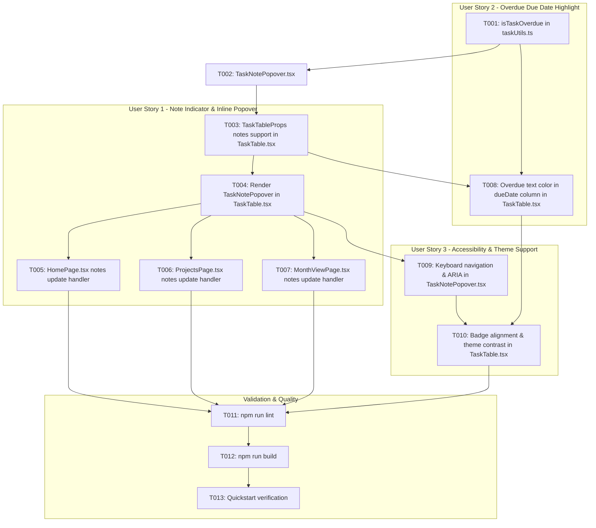

# Tasks: Indicador de Notas e Destaque de Tarefas Vencidas

**Feature**: Indicador de Notas e Destaque de Tarefas Vencidas
**Branch**: `010-task-notes-overdue-indicators`
**Spec**: [specs/010-task-notes-overdue-indicators/spec.md](file:///D:/Dev/ts-klip-project-frontend/specs/010-task-notes-overdue-indicators/spec.md)
**Plan**: [specs/010-task-notes-overdue-indicators/plan.md](file:///D:/Dev/ts-klip-project-frontend/specs/010-task-notes-overdue-indicators/plan.md)

---

## Phase 1: Setup (Shared Infrastructure)

**Purpose**: Utilities and helper functions for overdue calculations and note handling

- [X] T001 [P] Implement `isTaskOverdue` utility function in `src/lib/taskUtils.ts` to calculate overdue status based on client local date `YYYY-MM-DD` and completion status

---

## Phase 2: Foundational (Blocking Prerequisites)

**Purpose**: Reusable UI popover component and table update contract extensions

**⚠️ CRITICAL**: Must be completed before User Stories implementation

- [X] T002 Create reusable `TaskNotePopover` component in `src/components/TaskNotePopover.tsx` with popover trigger button, textarea, active/empty visual states, hover/focus visibility rules, keyboard shortcuts (`Escape`, `Ctrl+Enter`), and save/cancel actions
- [X] T003 Extend `TaskTableProps` and inline field handler in `src/components/TaskTable.tsx` to support inline updates with `notes?: string`

**Checkpoint**: Foundation ready - User Stories can now be implemented

---

## Phase 3: User Story 1 - Indicador e Edição Rápida de Notas/Observações na Tabela de Tarefas (Priority: P1) 🎯 MVP

**Goal**: Exibir balão interativo de notas ao lado do título em `TaskTable.tsx`, permitindo leitura, adição e edição rápida de notas via popover com persistência na API e atualização otimista

**Independent Test**: Localizar tarefas com e sem notas na tabela, passar o cursor sobre tarefas sem notas para visualizar o botão ou clicar no balão em tarefas com notas, abrir o popover, editar o texto, salvar e verificar que a nota é salva na API e refletida no estado local.

### Implementation for User Story 1

- [X] T004 [US1] Render `TaskNotePopover` in the task title column cell in `src/components/TaskTable.tsx` for both parent tasks and subtasks
- [X] T005 [US1] Update `HomePage.tsx` to handle `notes` in `updateTaskInline` / `persistTaskUpdate` with optimistic update and toast notifications
- [X] T006 [US1] Update `ProjectsPage.tsx` to handle `notes` in `updateTaskInline` / `persistTaskUpdate` with optimistic update and toast notifications
- [X] T007 [US1] Update `MonthViewPage.tsx` to handle `notes` in `updateTaskInline` / `persistTaskUpdate` with optimistic update and toast notifications

**Checkpoint**: User Story 1 (MVP) is fully functional and testable independently

---

## Phase 4: User Story 2 - Destaque Visual para Tarefas com Prazo Vencido (Priority: P2)

**Goal**: Aplicar destaque visual em tom avermelhado no texto da data de vencimento para tarefas pendentes com prazo vencido na coluna Prazo de `TaskTable.tsx`

**Independent Test**: Renderizar tarefas com data anterior ao dia atual e verificar a cor avermelhada do texto no seletor de data; marcar como concluída e verificar a desativação do destaque; alterar a data para hoje ou futuro e verificar a remoção do destaque.

### Implementation for User Story 2

- [X] T008 [US2] Integrate `isTaskOverdue` in the `dueDate` column cell of `src/components/TaskTable.tsx` to apply `text-red-600 dark:text-red-400 font-medium` styling to `DatePickerField` when overdue and not completed

**Checkpoint**: User Stories 1 AND 2 are independently functional and testable

---

## Phase 5: User Story 3 - Acessibilidade, Responsividade e Suporte a Temas (Priority: P3)

**Goal**: Garantir foco acessível, fechamento via `Escape`, salvamento via `Ctrl+Enter`, rótulos `aria-label`, contraste em tema claro/escuro e layout responsivo sem quebras de linha com múltiplos badges

**Independent Test**: Navegar pela tabela usando teclado, abrir popover com `Enter`/`Space`, salvar com `Ctrl+Enter`, alternar temas claro/escuro e verificar layout com títulos longos e múltiplos badges.

### Implementation for User Story 3

- [X] T009 [US3] Verify and refine keyboard accessibility, ARIA labels, and focus auto-focus behavior in `src/components/TaskNotePopover.tsx`
- [X] T010 [US3] Verify layout alignment, text truncation, and theme contrast across light/dark modes for multiple badges (Subtarefa, Google Calendar, Note Popover) in `src/components/TaskTable.tsx`

**Checkpoint**: All user stories meet quality, accessibility, and theme consistency criteria

---

## Phase 6: Polish & Cross-Cutting Concerns

**Purpose**: Validate compilation, linting, and end-to-end verification

- [X] T011 Run linter validation (`npm run lint`) and fix any reported warnings or errors
- [X] T012 Run build validation (`npm run build`) to ensure type safety and successful bundling
- [X] T013 Validate end-to-end user scenarios per `specs/010-task-notes-overdue-indicators/quickstart.md` using browser validation

---

## Dependencies & Execution Order



---

## Parallel Execution Examples

### Setup & Foundation
```bash
# Task T001 can run in parallel with component skeleton setup
Task: "Implement isTaskOverdue in src/lib/taskUtils.ts"
```

### User Story 1 Handlers
```bash
# Once T004 is complete, page handlers can be implemented concurrently:
Task: "Update HomePage.tsx notes update handler"
Task: "Update ProjectsPage.tsx notes update handler"
Task: "Update MonthViewPage.tsx notes update handler"
```

---

## Implementation Strategy

### MVP First (User Story 1 Only)
1. Complete Setup (`T001`) and Foundational (`T002`, `T003`).
2. Implement User Story 1 (`T004`, `T005`, `T006`, `T007`).
3. Validate note creation, editing, and balloon states in `TaskTable`.

### Incremental Delivery
1. Add User Story 2 (`T008`) for overdue task text color highlighting.
2. Polish accessibility and theme contrast in User Story 3 (`T009`, `T010`).
3. Execute quality gates (`T011`, `T012`, `T013`).
