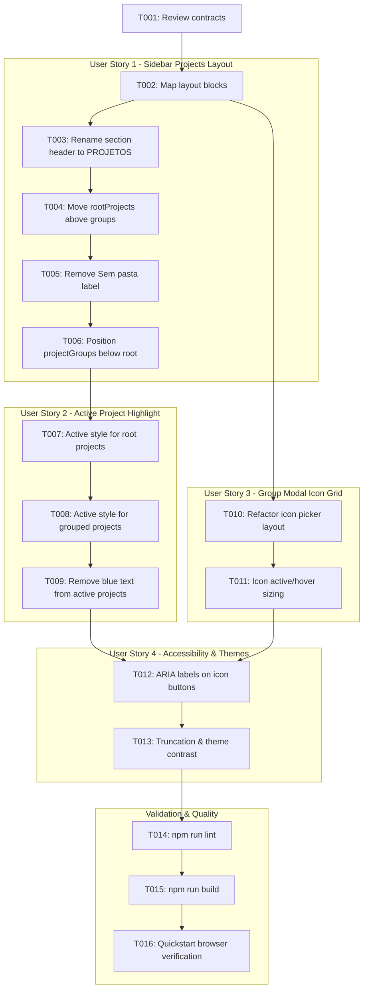

# Tasks: Refatoração da Barra Lateral e Modal de Grupos de Projetos

**Feature**: Refatoração da Barra Lateral e Ajuste no Modal de Grupos de Projetos
**Branch**: `011-sidebar-projects-refactor`
**Spec**: [specs/011-sidebar-projects-refactor/spec.md](file:///D:/Dev/ts-klip-project-frontend/specs/011-sidebar-projects-refactor/spec.md)
**Plan**: [specs/011-sidebar-projects-refactor/plan.md](file:///D:/Dev/ts-klip-project-frontend/specs/011-sidebar-projects-refactor/plan.md)

---

## Phase 1: Setup (Shared Infrastructure)

**Purpose**: Context verification and baseline preparation

- [x] T001 Review and verify contracts and design specifications in `specs/011-sidebar-projects-refactor/contracts/`

---

## Phase 2: Foundational (Blocking Prerequisites)

**Purpose**: Core presentation foundations and component structure

- [x] T002 Identify project list render blocks and icon grid containers in `src/components/Sidebar.tsx` and `src/components/AddProjectGroupModal.tsx`

**Checkpoint**: Presentation layout mapped - User Story implementations can proceed

---

## Phase 3: User Story 1 - Reorganização e Simplificação da Seção de Projetos na Barra Lateral (Priority: P1) 🎯 MVP

**Goal**: Exibir a seção de projetos com o título "PROJETOS", busca inalterada, projetos raiz no topo, pastas abaixo, e sem o rótulo "Sem pasta"

**Independent Test**: Expandir a barra lateral com projetos raiz e pastas criadas, e verificar que o título é "PROJETOS", a busca funciona, projetos raiz aparecem primeiro, pastas aparecem abaixo e não existe o texto "Sem pasta".

### Implementation for User Story 1

- [x] T003 [US1] Update section header title from "Projetos & Pastas" to "PROJETOS" in `src/components/Sidebar.tsx`
- [x] T004 [US1] Move `rootProjects` rendering block directly below the project search input in `src/components/Sidebar.tsx`
- [x] T005 [US1] Remove the "Sem pasta" section subheading and conditional header from `src/components/Sidebar.tsx`
- [x] T006 [US1] Position `projectGroups` list rendering block immediately below the `rootProjects` block in `src/components/Sidebar.tsx`

**Checkpoint**: User Story 1 (MVP) is functional and testable independently

---

## Phase 4: User Story 2 - Padronização do Destaque do Projeto Ativo na Barra Lateral (Priority: P2)

**Goal**: Padronizar o estilo de projeto selecionado na barra lateral com fundo arredondado suave (`bg-[var(--bg-soft-strong)] text-[var(--text-primary)]`) idêntico ao padrão de Inbox e Calendário, eliminando o texto azul

**Independent Test**: Clicar em um projeto na raiz ou dentro de uma pasta e verificar que o container recebe fundo suave com bordas arredondadas e a cor do texto permanece na cor padrão do tema (sem azul).

### Implementation for User Story 2

- [x] T007 [US2] Update active project container classes in `src/components/Sidebar.tsx` to use `bg-[var(--bg-soft-strong)] text-[var(--text-primary)] rounded-lg` for root projects
- [x] T008 [US2] Update active project container classes in `src/components/Sidebar.tsx` to use `bg-[var(--bg-soft-strong)] text-[var(--text-primary)] rounded-lg` for projects inside groups
- [x] T009 [US2] Remove blue text color (`text-[var(--brand)]`) from active project titles in `src/components/Sidebar.tsx`

**Checkpoint**: User Stories 1 AND 2 are independently functional and testable

---

## Phase 5: User Story 3 - Correção da Grade de Ícones no Modal de Grupos de Projetos (Priority: P2)

**Goal**: Corrigir a disposição dos ícones no modal de grupo de projetos eliminando sobreposições visuais e garantindo alinhamento responsivo e targets de clique acessíveis

**Independent Test**: Abrir o modal de criação/edição de grupo de projetos e verificar que os 11 ícones predefinidos são exibidos com tamanho uniforme, sem sobreposição de bordas e com feedback de seleção nítido.

### Implementation for User Story 3

- [x] T010 [P] [US3] Refactor icon selector container in `src/components/AddProjectGroupModal.tsx` from rigid 11-column grid to flexible wrapping layout (`flex flex-wrap gap-2` with fixed `h-9 w-9 shrink-0` buttons)
- [x] T011 [P] [US3] Ensure active and hover styles for icon buttons in `src/components/AddProjectGroupModal.tsx` maintain consistent box-sizing without displacing adjacent buttons

**Checkpoint**: User Stories 1, 2, AND 3 are functional and testable

---

## Phase 6: User Story 4 - Acessibilidade, Responsividade e Suporte a Temas (Priority: P3)

**Goal**: Garantir foco acessível por teclado, contraste em temas claro/escuro e truncamento elegante de nomes longos de projetos

**Independent Test**: Navegar com `Tab`/`Enter` pelos itens do sidebar e modal de grupos, alternar tema claro/escuro e testar projetos com títulos longos.

### Implementation for User Story 4

- [x] T012 [US4] Add/verify `aria-label` attributes on icon selector buttons in `src/components/AddProjectGroupModal.tsx`
- [x] T013 [US4] Verify text truncation and action button alignment on project items in `src/components/Sidebar.tsx` across light and dark modes

**Checkpoint**: All user stories meet accessibility and visual polish standards

---

## Phase 7: Polish & Cross-Cutting Concerns

**Purpose**: Code quality validation and end-to-end verification

- [x] T014 Run linter check (`npm run lint`) and fix any issues
- [x] T015 Run build check (`npm run build`) to ensure type safety and successful bundling
- [x] T016 Validate end-to-end user scenarios per `specs/011-sidebar-projects-refactor/quickstart.md` using Chrome DevTools MCP

---

## Dependencies & Execution Order



---

## Parallel Execution Examples

### User Story 3 vs User Story 1 & 2
```bash
# AddProjectGroupModal.tsx tasks can run concurrently with Sidebar.tsx updates:
Task: "Refactor icon selector container in src/components/AddProjectGroupModal.tsx"
Task: "Update section header title and reorder root projects in src/components/Sidebar.tsx"
```

---

## Implementation Strategy

### MVP First (User Story 1 Only)
1. Complete Setup (`T001`, `T002`).
2. Implement User Story 1 (`T003`–`T006`).
3. Validate sidebar layout reordering.

### Incremental Delivery
1. Add User Story 2 (`T007`–`T009`) for active project styling.
2. Add User Story 3 (`T010`, `T011`) for modal icon grid fix.
3. Polish accessibility in User Story 4 (`T012`, `T013`).
4. Execute validation gates (`T014`, `T015`, `T016`).
