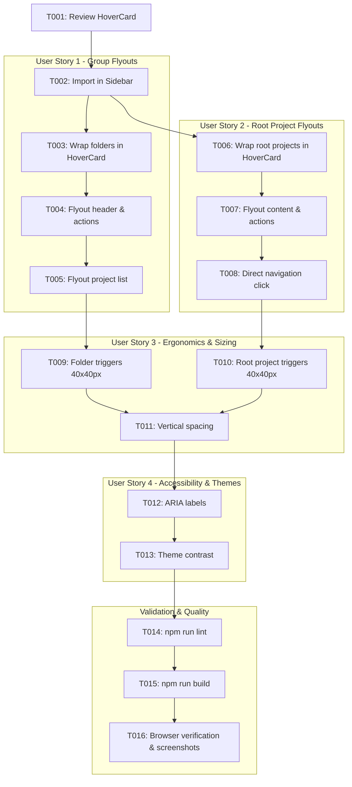

# Tasks: Menu Flutuante (Flyout) e Ergonomia da Barra Lateral Recolhida

**Feature**: Menu Flutuante (Flyout) e Ergonomia da Barra Lateral Recolhida
**Branch**: `012-sidebar-collapsed-flyout`
**Spec**: [specs/012-sidebar-collapsed-flyout/spec.md](file:///D:/Dev/ts-klip-project-frontend/specs/012-sidebar-collapsed-flyout/spec.md)
**Plan**: [specs/012-sidebar-collapsed-flyout/plan.md](file:///D:/Dev/ts-klip-project-frontend/specs/012-sidebar-collapsed-flyout/plan.md)

---

## Phase 1: Setup (Shared Infrastructure)

**Purpose**: Context verification and UI component preparation

- [x] T001 Review HoverCard primitive export and contracts in `src/components/ui/hover-card.tsx` and `specs/012-sidebar-collapsed-flyout/contracts/`

---

## Phase 2: Foundational (Blocking Prerequisites)

**Purpose**: Setup helper imports and layout containers in `Sidebar.tsx`

- [x] T002 Import `HoverCard`, `HoverCardTrigger`, and `HoverCardContent` in `src/components/Sidebar.tsx`

**Checkpoint**: Foundation ready - User story implementations can proceed

---

## Phase 3: User Story 1 - Menu Flutuante (Flyout) para Pastas/Grupos (Priority: P1) 🎯 MVP

**Goal**: Exibir balão flutuante no hover/clique para pastas na barra lateral recolhida, com cabeçalho, ações rápidas e lista clicável de projetos

**Independent Test**: Recolher a barra lateral, passar o mouse sobre o ícone de uma pasta e verificar se surge o balão lateral à direita com o cabeçalho da pasta, ações rápidas e a lista de projetos, permitindo navegar para qualquer projeto.

### Implementation for User Story 1

- [x] T003 [US1] Wrap collapsed folder items in `HoverCard` with `openDelay={150}` and `closeDelay={120}` in `src/components/Sidebar.tsx`
- [x] T004 [US1] Implement Flyout header with folder name, color, icon, project count badge, and quick actions (+ project, edit, delete) in `src/components/Sidebar.tsx`
- [x] T005 [US1] Implement Flyout project list with color dots, active project highlight, direct navigation click, and empty state in `src/components/Sidebar.tsx`

**Checkpoint**: User Story 1 (MVP) is functional and testable independently

---

## Phase 4: User Story 2 - Balão Informativo para Projetos Raiz (Priority: P1)

**Goal**: Exibir balão lateral no hover para projetos raiz na barra lateral recolhida com nome completo, cor e ações rápidas, permitindo navegação direta no clique

**Independent Test**: Na barra lateral recolhida, passar o mouse sobre o botão de um projeto raiz e verificar se o balão exibe o nome e ações, e clicar no botão para navegar para o projeto.

### Implementation for User Story 2

- [x] T006 [US2] Wrap collapsed root project items in `HoverCard` with `openDelay={150}` and `closeDelay={120}` in `src/components/Sidebar.tsx`
- [x] T007 [US2] Implement Flyout content for root projects with full name, color dot, and quick action buttons (edit, archive, delete) in `src/components/Sidebar.tsx`
- [x] T008 [US2] Ensure direct click on collapsed root project trigger navigates immediately to `/project/:id` in `src/components/Sidebar.tsx`

**Checkpoint**: User Stories 1 AND 2 are functional and testable

---

## Phase 5: User Story 3 - Ergonomia Visual e Padronização Vertical (Priority: P2)

**Goal**: Padronizar as dimensões dos botões da barra recolhida em 40x40px (`h-10 w-10`), com alinhamento centralizado e espaçamento vertical limpo

**Independent Test**: Inspecionar a barra lateral recolhida e verificar que todos os itens possuem dimensões `h-10 w-10`, alinhamento centralizado e transição visual suave.

### Implementation for User Story 3

- [x] T009 [US3] Standardize collapsed folder triggers to `h-10 w-10` with centered icon and `rounded-lg` hover styles in `src/components/Sidebar.tsx`
- [x] T010 [US3] Standardize collapsed root project triggers to `h-10 w-10` with centered `h-2.5 w-2.5` color dot and `rounded-lg` active/hover styles in `src/components/Sidebar.tsx`
- [x] T011 [US3] Ensure vertical spacing (`space-y-1` / `py-1`) provides balanced padding between collapsed items in `src/components/Sidebar.tsx`

**Checkpoint**: User Stories 1, 2, AND 3 are functional and visually ergonomic

---

## Phase 6: User Story 4 - Acessibilidade, Navegação por Teclado e Suporte a Temas (Priority: P3)

**Goal**: Garantir acessibilidade com `aria-label`, foco por teclado, fechamento com `Escape` e suporte aos temas claro/escuro

**Independent Test**: Navegar com `Tab` pelos ícones recolhidos, verificar anéis de foco e testar em tema claro e escuro.

### Implementation for User Story 4

- [x] T012 [US4] Add descriptive `aria-label` attributes on collapsed folder and root project triggers in `src/components/Sidebar.tsx`
- [x] T013 [US4] Verify theme variables (`var(--bg-card)`, `var(--border-subtle)`, `var(--text-primary)`) on Flyout cards across light and dark modes in `src/components/Sidebar.tsx`

**Checkpoint**: All user stories meet accessibility and visual polish standards

---

## Phase 7: Polish & Cross-Cutting Concerns

**Purpose**: Code quality validation and end-to-end verification

- [x] T014 Run linter check (`npm run lint`) and fix any issues
- [x] T015 Run build check (`npm run build`) to ensure type safety and successful bundling
- [x] T016 Validate end-to-end user scenarios in browser per `specs/012-sidebar-collapsed-flyout/quickstart.md` using Chrome DevTools MCP

---

## Dependencies & Execution Order

---

## Implementation Strategy

### MVP First (User Story 1 Only)
1. Complete Setup & Foundation (`T001`, `T002`).
2. Implement User Story 1 (`T003`–`T005`).
3. Validate folder Flyout interaction in collapsed sidebar.

### Incremental Delivery
1. Add User Story 2 (`T006`–`T008`) for root project Flyouts.
2. Standardize sizing and vertical rhythm in User Story 3 (`T009`–`T011`).
3. Polish accessibility & themes in User Story 4 (`T012`, `T013`).
4. Execute validation gates (`T014`, `T015`, `T016`).
