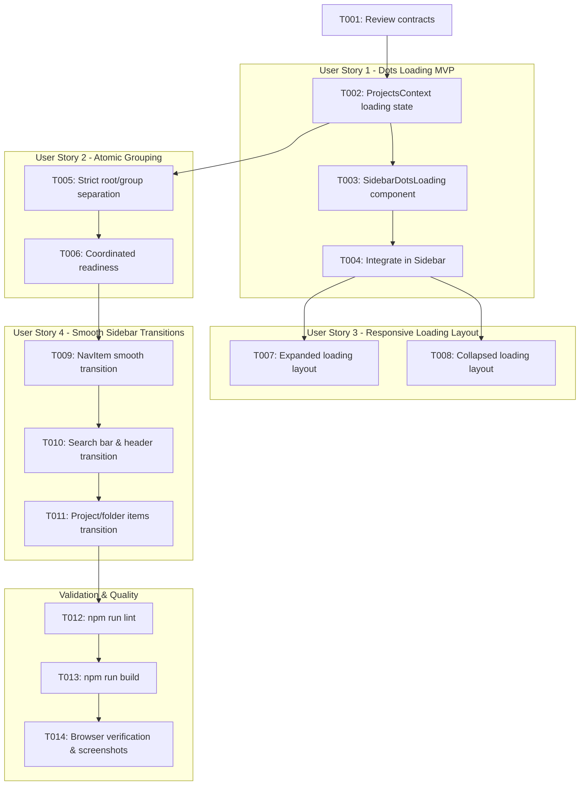

# Tasks: Estado de Carregamento Animado, Sincronização e Transição Suave da Barra Lateral

**Feature**: Estado de Carregamento Animado, Sincronização e Transição Suave da Barra Lateral
**Branch**: `013-sidebar-loading-state`
**Spec**: [specs/013-sidebar-loading-state/spec.md](file:///D:/Dev/ts-klip-project-frontend/specs/013-sidebar-loading-state/spec.md)
**Plan**: [specs/013-sidebar-loading-state/plan.md](file:///D:/Dev/ts-klip-project-frontend/specs/013-sidebar-loading-state/plan.md)

---

## Phase 1: Setup (Shared Infrastructure)

**Purpose**: Verify contracts and prepare loading animation helper

- [x] T001 Review contract and animation specs in `specs/013-sidebar-loading-state/contracts/sidebar-loading-transition.contract.md`

---

## Phase 2: Foundational (Blocking Prerequisites)

**Purpose**: Extend ProjectsContext with loading state management

- [x] T002 Expose `isLoading`, `isLoadingProjects`, and `isLoadingGroups` state from `src/contexts/ProjectsContext.tsx`

**Checkpoint**: Foundation ready - User stories can proceed

---

## Phase 3: User Story 1 - Indicador Visual de Carregamento Animado (Priority: P1) 🎯 MVP

**Goal**: Exibir 3 pontos pulsantes em sequência (*dots loading* puro) na seção de projetos da barra lateral durante o carregamento inicial

**Independent Test**: Recarregar a página e confirmar que a seção de projetos exibe o indicador de dots animados até a resolução dos dados

### Implementation for User Story 1

- [x] T003 [US1] Create `SidebarDotsLoading` component with 3 pulsing dots in CSS/Tailwind in `src/components/Sidebar.tsx`
- [x] T004 [US1] Integrate `SidebarDotsLoading` in `src/components/Sidebar.tsx` to display while initial project/group requests are pending

**Checkpoint**: User Story 1 (MVP) is functional and testable independently

---

## Phase 4: User Story 2 - Renderização Atômica e Fim dos Pulos Visuais (Priority: P1)

**Goal**: Garantir que projetos associados a grupos nunca sejam classificados ou exibidos como projetos raiz durante o carregamento

**Independent Test**: Abrir a aplicação e verificar que nenhum projeto pertencente a uma pasta aparece na raiz ou pula de posição

### Implementation for User Story 2

- [x] T005 [US2] Update project grouping logic in `src/components/Sidebar.tsx` to strictly place projects with `groupId` into `groupMap` and never into `rootProjects`
- [x] T006 [US2] Coordinate initial data readiness via `Promise.all` in `src/components/Sidebar.tsx` with smooth fade-in transition

**Checkpoint**: User Stories 1 AND 2 are functional and stable

---

## Phase 5: User Story 3 - Suporte aos Modos Expandido e Recolhido (Priority: P2)

**Goal**: Adaptar o layout do indicador de loading animado para os modos expandido e recolhido da barra lateral

**Independent Test**: Recarregar com barra expandida (3 pontos horizontais) e com barra recolhida (3 pontos compactos centralizados)

### Implementation for User Story 3

- [x] T007 [US3] Implement expanded mode horizontal layout for `SidebarDotsLoading` in `src/components/Sidebar.tsx`
- [x] T008 [US3] Implement collapsed mode compact centered layout for `SidebarDotsLoading` in `src/components/Sidebar.tsx`

**Checkpoint**: User Stories 1, 2, AND 3 are functional and responsive

---

## Phase 6: User Story 4 - Animação Suave dos Itens Internos da Barra Lateral (Priority: P2)

**Goal**: Implementar transições CSS graduais de opacidade e largura para todos os textos, badges, botões e campo de busca ao expandir/recolher

**Independent Test**: Clicar em "Recolher" / "Expandir" e verificar que todos os elementos internos esmaecem e deslizam suavemente sem saltos bruscos

### Implementation for User Story 4

- [x] T009 [US4] Add smooth width/opacity transition to navigation labels and badges in `src/components/NavItem.tsx`
- [x] T010 [US4] Add smooth width/opacity transition to search bar and section headers in `src/components/Sidebar.tsx`
- [x] T011 [US4] Add smooth transition to project titles, folder names, and action buttons in `src/components/Sidebar.tsx`

**Checkpoint**: All user stories achieve smooth transitions without jitter

---

## Phase 7: Polish & Cross-Cutting Concerns

**Purpose**: Code quality validation and end-to-end verification

- [x] T012 Run linter check (`npm run lint`) and fix any issues
- [x] T013 Run build check (`npm run build`) to ensure type safety and successful bundling
- [x] T014 Validate end-to-end user scenarios in browser per `specs/013-sidebar-loading-state/quickstart.md` using Chrome DevTools MCP

---

## Dependencies & Execution Order

---

## Implementation Strategy

### MVP First (User Story 1 Only)
1. Complete Setup & Foundation (`T001`, `T002`).
2. Implement User Story 1 (`T003`, `T004`).
3. Validate dots loading indicator during initial render.

### Incremental Delivery
1. Add User Story 2 (`T005`, `T006`) to fix grouping race conditions.
2. Adapt layouts in User Story 3 (`T007`, `T008`).
3. Polish smooth transitions in User Story 4 (`T009`–`T011`).
4. Execute validation gates (`T012`–`T014`).
